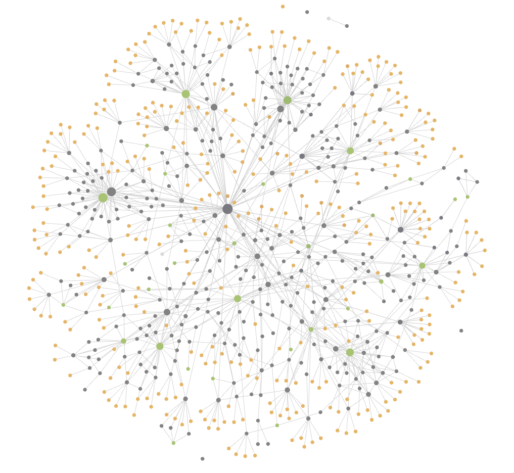

# JavaNotes
**Хватит читать чужие гайды по программированию на Java - напиши свой!**

Хочешь научиться программировать или улучшить свои навыки? Тогда не ограничивайся только чтением готовых руководств и книг. Самый лучший способ усвоить знания - это практика и рефлексия. Поэтому я предлагаю тебе создать свою собственную базу знаний по программированию, используя мой проект в качестве основы.

Мой проект - это база знаний о программировании на Java, написанная с помощью [Obsidian](https://obsidian.md/), которая содержит различные темы, примеры кода, советы и ссылки на полезные ресурсы. Пока это больше похоже на рабочие заметки, понятные мне одному =) 

Если ты тоже хотел начать вести свою базу знаний, но не знал как это сделать, можешь скопировать мой проект к себе в Obsidian и адаптировать его под свои цели и интересы:
- удалить то, что не нужно
- переписать некоторые моменты по-другому 
- добавить свои мысли и идеи

Более того, ты можешь помочь проекту, если поделишься своим видением гайда по Java разработке через GitHub.
Считайте это экспериментом по [“Learning in public”](https://notes.nicolevanderhoeven.com/Learning+in+public).

# Краткое содержание
## Java Core

- [Основы ООП](notes/Основы ООП.md)
    
    - [Ассоциация агрегация композиция](notes/Ассоциация агрегация композиция.md)
    - [Принципы SOLID](notes/Принципы SOLID.md)
- [Java Core](notes/Java Core.md)
    
    - [Классы Java](notes/Классы Java.md)
    - [Collection](notes/Collection.md)
    - [Обобщения generics](notes/Обобщения generics.md)
        - [Принцип PECS](notes/Принцип PECS.md)
    - [Stream API](notes/Stream API.md)
    - [Клонирование](notes/Клонирование.md)
    - [Структура JDK](notes/Структура JDK.md)
    - [Garbage collector](notes/Garbage collector.md)

## Многопоточность

- [Многопоточность в Java](notes/Многопоточность в Java.md)
    - [Отличие Thread от Runnable создание потоков](notes/Отличие Thread от Runnable создание потоков.md)
    - [В каких состояниях может находиться поток](notes/В каких состояниях может находиться поток.md)
    - [Синхронизация в Java](notes/Синхронизация в Java.md)
        - [Монитор в Java](notes/Монитор в Java.md)
    - [Объект Future](notes/Объект Future.md)
        - [FutureTask](notes/FutureTask.md)

## SQL

- [SQL](notes/SQL.md)
    - [Структура данных в БД](notes/Структура данных в БД.md)
    - [Операции SQL по группам](notes/Операции SQL по группам.md)
        - [Агрегатные функции](notes/Агрегатные функции.md)
        - [Подзапросы](notes/Подзапросы.md)
    - [Транзакции принцип ACID](notes/Транзакции принцип ACID.md)
    - [Индексы SQL](notes/Индексы SQL.md)
    - [INNER JOIN], [OUTER JOIN](notes/INNER JOIN, OUTER JOIN.md)
    - [SQL оценка производительности](notes/SQL оценка производительности.md)

## Hibernate

- [JPA Hibernate и JDBC сравнение интерфейсов](notes/JPA Hibernate и JDBC сравнение интерфейсов.md)
- [Hibernate](notes/Hibernate.md)
    - [Каким условиям должен удовлетворять класс чтобы являться Entity](notes/Каким условиям должен удовлетворять класс чтобы являться Entity.md)
    - [EntityManager](notes/EntityManager.md)
    - [Проблема N plus 1 Select Hibernate](notes/Проблема N plus 1 Select Hibernate.md)
        - [Fetch type Hibernate](notes/Fetch type Hibernate.md)
        - [Entity Graph](notes/Entity Graph.md)
    - [Cтратегии маппинга иерархии наследования Inheritance Mapping Strategies в JPA](notes/Cтратегии маппинга иерархии наследования Inheritance Mapping Strategies в JPA.md)
    - [Criteria API](notes/Criteria API.md)

## Spring

- [Spring](notes/Spring.md)
    - [Spring Dependency Injection и Inversion of Control](notes/Spring Dependency Injection и Inversion of Control.md)
    - [Spring WEB](notes/Spring WEB.md)
    - [Spring Secutity](notes/Spring Secutity.md)
    - [Spring Boot](notes/Spring Boot.md)
    - [Spring AOP](notes/Spring AOP.md)

## Алгоритмы и паттерны

- [Алгоритмы](notes/Алгоритмы.md)
    - [Быстрая сортировка](notes/Быстрая сортировка.md)
    - [Жадные алгоритмы](notes/Жадные алгоритмы.md)
    - [Деревья](notes/Деревья.md)
- [Паттерны](notes/Паттерны.md)
    - [Порождающие паттерны](notes/Порождающие паттерны.md)
    - [Структурные паттерны](notes/Структурные паттерны.md)
    - [Поведенческие паттерны](notes/Поведенческие паттерны.md)

## Docker, Kafka

- [Docker](notes/Docker.md)
- [Kafka](notes/Kafka.md)

## Вдохновение 
 - [Nicole van der Hoeven](https://nicolevanderhoeven.com/) - [Fork My Brain](https://notes.nicolevanderhoeven.com/Fork+My+Brain)
 - [Snailclimb](https://github.com/Snailclimb) - [JavaGuide](https://javaguide.cn/)
 - [winterbe](https://github.com/winterbe) - https://winterbe.com/

